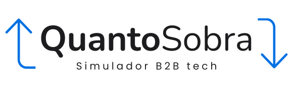

<p align="center">
  
</p>

<h3 align="center">Simulador B2B para profissionais de TI em Portugal</h3>

<p align="center">
  Percebe quanto sobra na tua conta pessoal ao fim do mês — depois de impostos, contribuições e contabilista.
</p>

<p align="center">
  <a href="#funcionalidades">Funcionalidades</a> •
  <a href="#para-quem-é">Para quem é</a> •
  <a href="#tecnologias">Tecnologias</a> •
  <a href="#como-correr-localmente">Instalação</a> •
  <a href="#como-funciona">Como funciona</a> •
  <a href="#licença">Licença</a>
</p>

---

## Para quem é

- **Developers, DevOps, Tech Leads** e outros profissionais de TI que trabalham por empresa B2B (unipessoal ou sociedade) em Portugal.
- Especialmente pensado para quem veio do **estrangeiro** (ex.: Brasil) e precisa perceber o modelo fiscal português — o equivalente ao «PJ».
- Quem quer saber **quanto dinheiro chega à conta pessoal** e como **optimizar legalmente** as ajudas de custo.

## Funcionalidades

| Funcionalidade | Descrição |
|---|---|
| **Simulação mensal completa** | Facturação → custos → impostos → líquido pessoal, tudo num ecrã |
| **Sugestão de ajudas de custo** | Calcula o valor máximo de ajudas que a empresa pode pagar sem prejuízo |
| **Modal com distribuição calculada** | Mostra como distribuir a sugestão por despesas reais (refeição, deslocações, internet…) |
| **Fluxo do dinheiro visual** | Diagrama passo a passo: cliente → empresa → pessoa → Estado |
| **Calendário fiscal** | Datas reais de obrigações fiscais e contributivas em Portugal |
| **Tabelas detalhadas** | Decomposição empresa / trabalhador / Estado com cores por domínio |
| **Personalização** | Nome da empresa e do colaborador propagados por toda a interface |
| **Documentação integrada** | Página «Como funciona» com explicação simples para leigos |
| **100% no browser** | Nenhuma informação é guardada — tudo funciona localmente |

## Tecnologias

| Stack | Versão |
|---|---|
| [React](https://react.dev) | 19 |
| [React Router](https://reactrouter.com) | 7 |
| [Vite](https://vite.dev) | 8 |
| [TypeScript](https://typescriptlang.org) | 5.9 |
| [Vitest](https://vitest.dev) | 4 |
| CSS puro (custom properties) | — |

## Como correr localmente

```bash
# 1. Clonar o repositório
git clone git@github.com:renatoruis/quantosobra.git
cd quantosobra

# 2. Instalar dependências
npm install

# 3. Iniciar servidor de desenvolvimento
npm run dev
```

Abre [http://localhost:5173](http://localhost:5173) no browser.

### Outros comandos

```bash
npm run build      # Build de produção (output em dist/)
npm run preview    # Preview do build de produção
npm run test       # Correr testes unitários
npm run test:watch # Testes em modo watch
npm run lint       # ESLint
```

## Como funciona

O simulador faz todas as contas **mensais** e por **estimativa** — não substitui o contabilista.

### 1. Facturação

`Receita = tarifa diária × dias trabalhados`

O IVA (23%) é cobrado ao cliente mas não é lucro — é entregue ao Estado.

### 2. Custos da empresa

- **Ordenado bruto** (mínimo 920 €)
- **Segurança Social empregador** — 23,75%
- **Segurança Social trabalhador** — 11% (descontado no recibo)
- **Ajudas de custo** + 5% de tributação autónoma
- **Contabilista** (valor sem IVA + 23%)

### 3. IRC

21% sobre o lucro (receita − custos). Se não há lucro, não há IRC.

### 4. IRS

Estimativa progressiva com base no ordenado anual. Até ~1 000 €/mês o IRS é praticamente zero.

### 5. Líquido pessoal

`Líquido = ordenado bruto − Seg. Social − IRS + ajudas de custo`

### Sugestão de ajudas

Cada 1 € de ajuda custa 1,05 € à empresa. O sistema calcula o máximo possível sem prejuízo:

`Ajudas máx ≈ margem / 1,05`

## Estrutura do projecto

```
src/
├── engine/                 # Motor de cálculo (puro, sem UI)
│   ├── types.ts            # Constantes e tipos
│   ├── calculateSimulation.ts
│   ├── irs.ts              # Estimativa de IRS
│   ├── reserves.ts         # Reservas da empresa
│   └── suggestAllowance.ts # Sugestão de ajudas
├── components/             # Componentes React
│   ├── AllowanceExamplesModal.tsx
│   ├── AllowanceSuggestion.tsx
│   ├── BreakdownTables.tsx
│   ├── CashFlowDiagram.tsx
│   ├── CompanyReserves.tsx
│   ├── Dashboard.tsx
│   ├── PersonalOutcome.tsx
│   ├── SimulationForm.tsx
│   ├── SiteHeader.tsx
│   ├── SiteFooter.tsx
│   └── Timeline.tsx
├── pages/
│   ├── SimuladorPage.tsx   # Página principal
│   └── ContextoPage.tsx    # Documentação
├── format.ts               # Formatação e display names
├── index.css               # Estilos globais
└── main.tsx                # Entry point
```

## Privacidade

**Nenhuma informação é recolhida ou guardada.** Todo o cálculo acontece no browser — os dados nunca saem do teu computador.

## Licença

MIT © [Renato Ruis](https://github.com/renatoruis)
